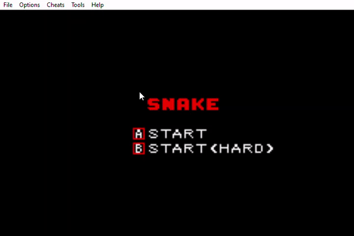

# Reverse Snake

Reverse Snake is our reimagining of the classic [Snake](https://en.wikipedia.org/wiki/Snake_(video_game_genre)) game! 

In classic Snake, the player controls the Snake to locate & eat a food item. 

In Reverse Snake, the player instead controls the food item to reach a destination without getting eaten by the Snake. Doing so progresses the player to the next level. For each level, the Snake's speed gets incrementally faster & the player & Snake are spawned at random locations in the map, but always in opposite quadrants.

Reverse Snake can be played on the Visual Boy Advance (VBA) emulator. Reverse Snake is written in Assembly & C.

Reverse Snake was built with ❤️ by [Bryan Zheng](https://github.com/Ashuh), [Haikal Yusuf](https://github.com/waffledood) & [Selva Vignesh](https://github.com/selvavignesh-2206).

## Sources of Inspiration

Below were various sources that inspired us:
- [Reverse Snake](http://reverse-snake.github.io/), where players place a food item at random locations to forcibly crash the snake
- Coding Dojo's [Reverse Snake](https://youtu.be/zH3zyZ4q0oU), where players control the food's movement & try to outrun the snake

